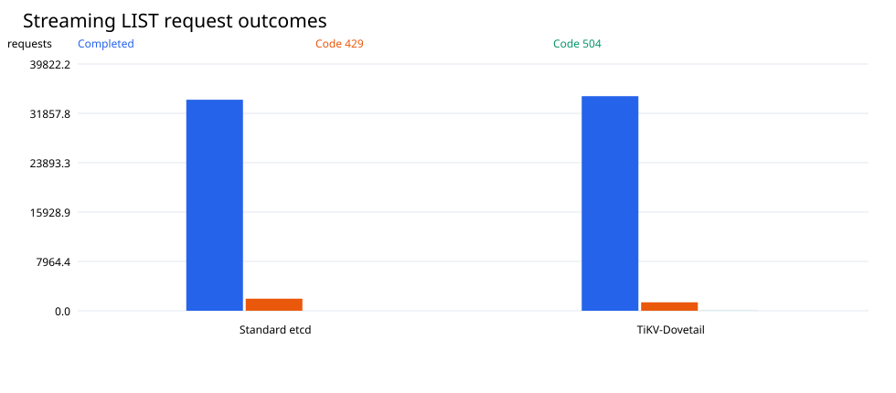
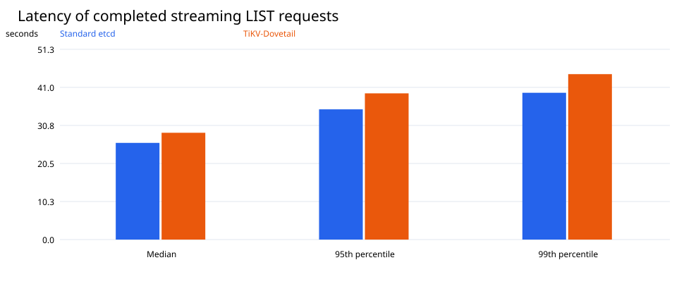
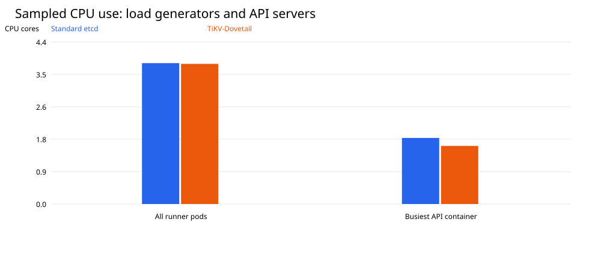
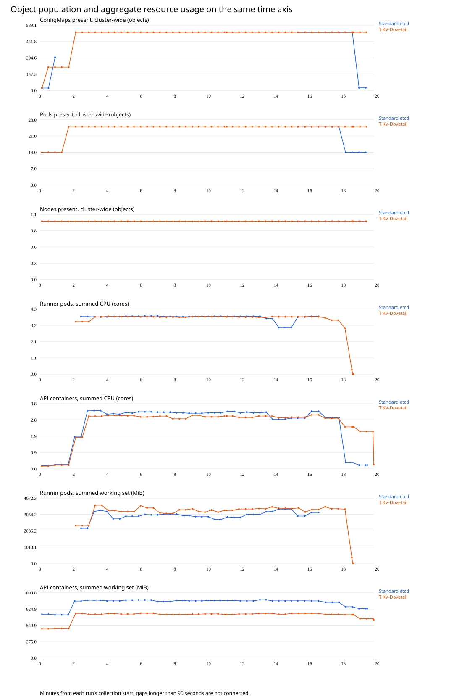
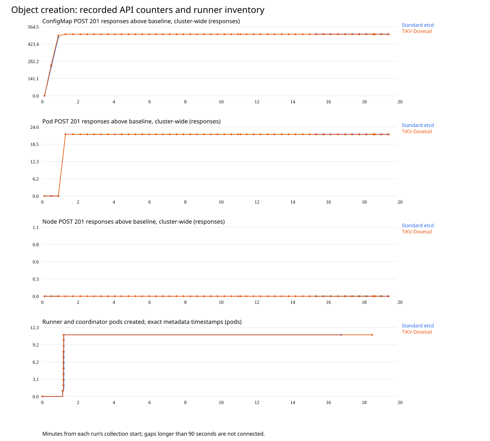
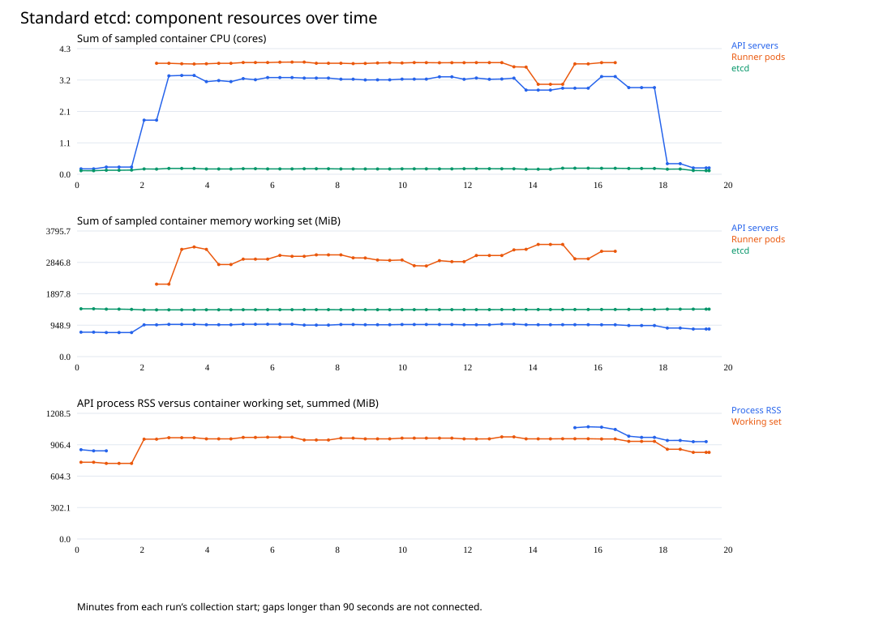
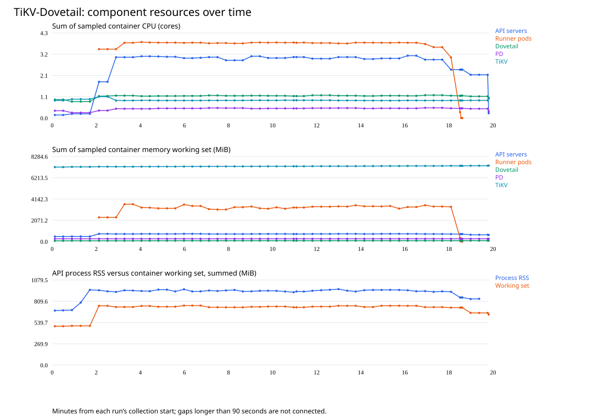
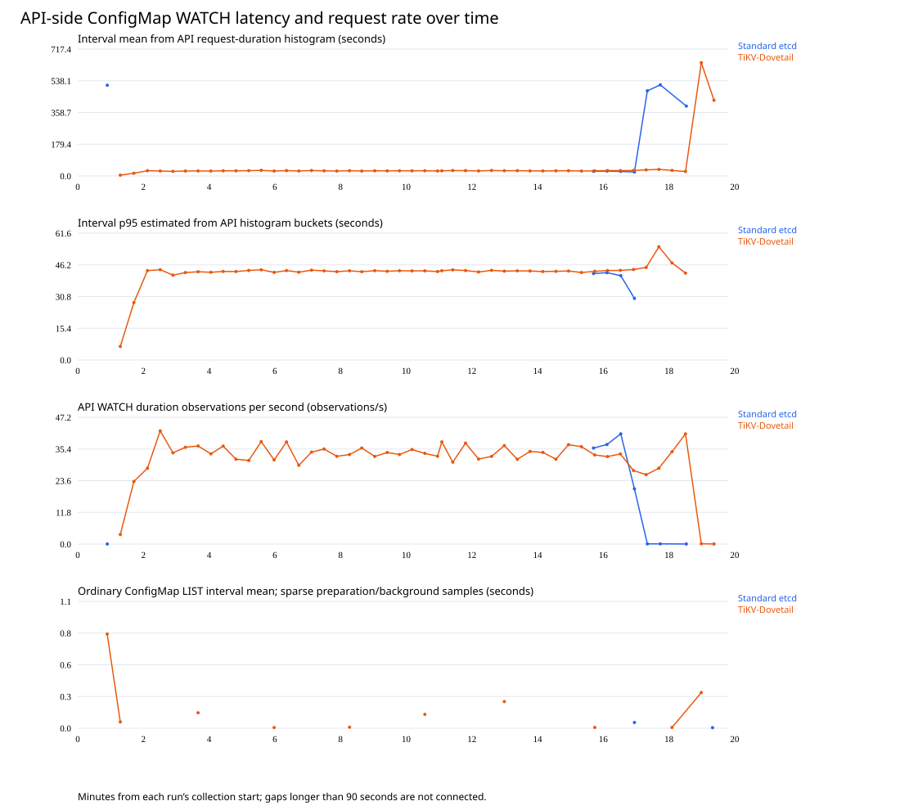
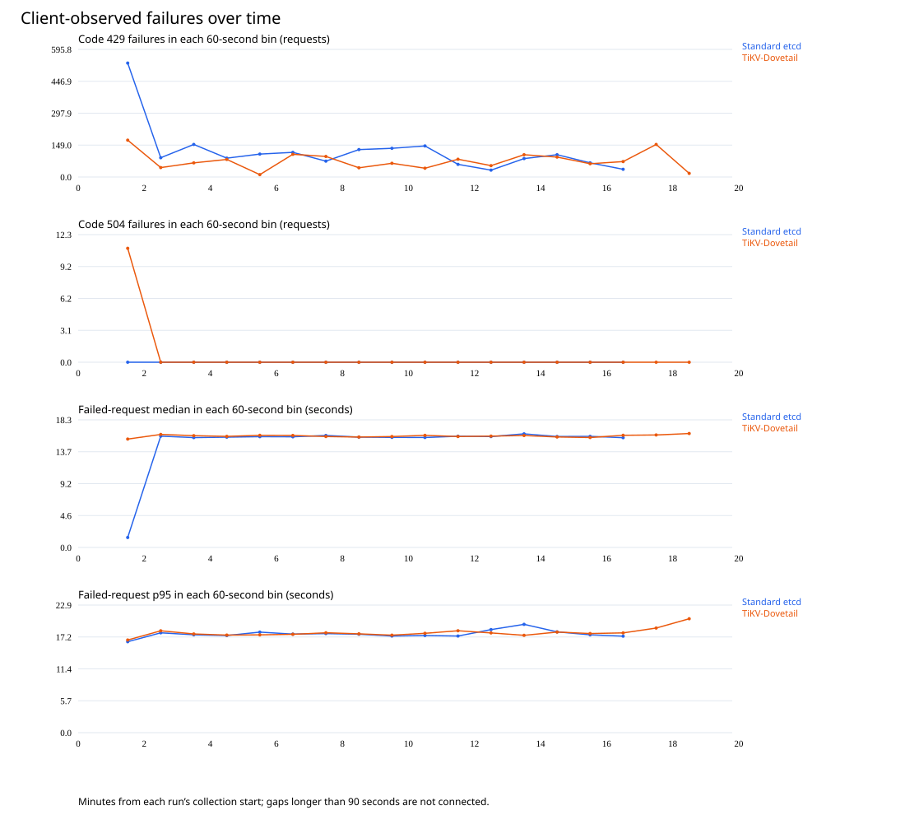

# Kubernetes Streaming LIST: A Two-Run Comparison of etcd and TiKV-Dovetail

**Experimental report · 18 September 2026**

## Abstract

We compared Kubernetes streaming LIST on two standalone AKS clusters: one using standard etcd and one using TiKV through Dovetail’s etcd-compatible frontend. Each run attempted 36,000 requests using the same workload, API-server version and limits, and a single four-core load-generator worker. Standard etcd completed 34,052 requests (94.59%); TiKV-Dovetail completed 34,628 (96.19%). Among completed requests, etcd had lower median latency (26.06 versus 28.78 seconds) and lower 95th-percentile latency (35.10 versus 39.41 seconds). TiKV-Dovetail completed 576 more requests, while etcd finished the request budget sooner. Both load-generator workers reached their CPU capacity, and both runs returned errors. These results describe end-to-end behavior under the tested client constraint; they do not establish either backend’s maximum capacity.

## 1. What is TiKV, and why evaluate it?

### 1.1 TiKV and Multi-Raft

TiKV is an open-source distributed transactional key-value store. It divides its keyspace into contiguous partitions called **Regions**. Each Region is replicated through its own Raft consensus group, and a TiKV node hosts replicas belonging to many such groups. Regions can split as they grow and merge when small; replica placement and leadership can be distributed across storage nodes.

TiKV calls this arrangement **Multi-Raft**. It means managing multiple ordinary Raft groups on a node, not replacing Raft with a different consensus algorithm. As the TiKV documentation explains, comparing Multi-Raft with Raft is not analogous to comparing Multi-Paxos with Paxos. Each Region still uses Raft for its own replicated log; the additional layer manages many groups together [1].

### 1.2 Why this matters for Kubernetes storage

A standard etcd cluster replicates its keyspace through one Raft group. Adding voting members to that group adds replicas rather than dividing the keyspace into independently led shards. TiKV’s Region-based design offers a different scaling approach: data and consensus work can be partitioned across many groups and distributed across more storage nodes.

That horizontal-scaling potential motivates this evaluation. We want to understand whether a partitioned transactional store can support Kubernetes storage semantics and useful end-to-end performance through Dovetail’s etcd-compatible interface. Dovetail connects Kubernetes’ existing etcd3 client to TiKV; it must preserve the revision, transaction and watch behavior Kubernetes expects.

Multi-Raft alone does not guarantee that this integration scales. Independent Regions can distribute work, but a shared metadata key, cross-Region transactions, gateway coordination, or Kubernetes API processing can still serialize requests. In this implementation, changing transactions update a shared dataset control record to preserve revision ordering. That remains a potential contention point even when user data spans multiple Regions.

The two runs in this paper evaluate one Kubernetes streaming LIST workload at a fixed deployment size. They do not vary the number of TiKV nodes or Regions, and initial objects are served through Kubernetes’ watch-cache machinery. They therefore assess the integration’s observed behavior, not the scaling benefit of Multi-Raft itself. Establishing that benefit requires a separate experiment that varies dataset size, key distribution, concurrency and storage-node count.

**Source [1]:** TiKV, “Multi-raft,” Scalability Deep Dive. https://tikv.org/deep-dive/scalability/multi-raft/ (accessed 18 September 2026).

### 1.3 Online space reclamation: a second motivation

TiKV’s RocksDB-based data engine performs LSM-tree compaction in background threads: it merges and rewrites sorted files and removes obsolete entries when they are eligible for removal [2]. **Normal background compaction does not require planned cluster downtime.** This offers a potential operational advantage for a continuously available Kubernetes control plane, alongside Multi-Raft’s scaling potential.

The comparison with etcd needs a precise distinction. In etcd, logical history compaction and physical database defragmentation are separate operations. Defragmenting a live etcd member blocks reads and writes on that member while its database is rebuilt [3]. A healthy replicated cluster can be maintained one member at a time; this does not inherently require shutting down the entire cluster. TiKV’s background LSM compaction follows a different maintenance model rather than performing an identical defragmentation operation without cost.

| Impact area | TiKV compaction behavior | Operational consequence |
|---|---|---|
| Availability | Normal background compaction runs while the service remains online | No planned cluster shutdown, but this is not a guarantee that every request meets its deadline |
| Disk I/O and CPU | Compaction reads and rewrites files, consuming bandwidth and CPU | Write amplification and competition with foreground requests |
| Latency | Heavy compaction can compete with reads and writes | Latency spikes and jitter are possible |
| Write throughput | Compaction backlog can trigger backpressure | Writes may slow, stall, or receive ServerIsBusy; the behavior depends on TiKV flow-control settings |

Operational tuning should use the deployed version’s documented controls. TiKV v8.5 documents `storage.io-rate-limit.max-bytes-per-sec`, which favors throttling background work when the configured I/O limit is reached, and `storage.flow-control` for write backpressure [4]. Limit background work only with enough bandwidth left to keep up with the sustained write workload: an overly restrictive setting can grow the compaction backlog. Any deliberate manual compaction should be bounded and scheduled for a low-traffic window, with disk utilization, pending compaction work, rejected/stalled writes, and tail latency monitored.

Titan is a related key-value-separation option that can reduce LSM write amplification for larger values [5]. It is not an unconditional recommendation for Kubernetes LIST workloads: the documented trade-offs include additional disk space and potentially worse range-scan performance. The appropriate value-size threshold depends on the workload. This study neither verified Titan’s effective configuration nor compared Titan settings.

**Scope of this experiment:** neither kperf run deliberately exercised a defragmentation or compaction campaign, so the results do not measure maintenance downtime or prove negligible compaction impact. RocksDB physical compaction also does not replace TiKV MVCC garbage collection or Dovetail’s logical history retention policy. This experimental Dovetail deployment retained history with the TiKV GC safepoint at zero; long-term history reclamation remains unqualified. Online maintenance is a motivation for evaluating the architecture, not an outcome established by these streaming LIST measurements.

**Source [2]:** PingCAP, “RocksDB Overview,” background threads, compaction and write stalls. https://docs.pingcap.com/tidb/stable/rocksdb-overview/

**Source [3]:** etcd v3.5 Operations Guide, “Maintenance,” defragmentation. https://etcd.io/docs/v3.5/op-guide/maintenance/

**Source [4]:** PingCAP, “TiKV Configuration File,” v8.5, storage I/O rate limits and flow control. https://docs.pingcap.com/tidb/stable/tikv-configuration-file/

**Source [5]:** PingCAP, “Titan Overview,” benefits and range-query/storage trade-offs. https://docs.pingcap.com/tidb/stable/titan-overview/

Sources [2]–[5] accessed 18 September 2026. Configuration guidance is background context; no configuration changes were made for this report update.

### 1.4 Research question

How do standard etcd and TiKV-Dovetail compare in streaming LIST completion, latency, and resource use when the Kubernetes API and load-generator configurations are held constant?

A streaming LIST sends the selected objects as watch events, followed by a bookmark marking the end of the initial object set. For this workload, successful completion means that kperf received that bookmark. It does not mean merely opening an HTTP connection or receiving an HTTP 200 response. The test measures repeated initial snapshots, rather than continuous watch-delivery latency after the initial snapshot.

## 2. Experimental setup

### 2.1 Cluster configuration

Both customer clusters ran in eastus2 on the same hosting standalone. Normal Kubernetes and AKS controllers remained enabled. Each had two API-server replicas and one customer worker on which all ten kperf runners were scheduled.

| Setting | Standard etcd | TiKV-Dovetail |
|---|---|---|
| Kubernetes API image | v1.35.8-4 | v1.35.8-4 |
| API replicas | 2 | 2 |
| CPU limit per API container | 2 cores | 2 cores |
| Memory limit per API container | 3 GB, decimal | 3 GB, decimal |
| API CPU / memory request | 200m / 800 MB | 200m / 800 MB |
| Load-generator worker | One Standard_D4s_v4, 4 vCPUs | One Standard_D4s_v4, 4 vCPUs |
| Storage deployment | Three etcd members | Two Dovetail frontends, three PD members, three TiKV stores |
| Storage replication | Three-member replicated system | Three voting replicas per region |
| API storage connection | etcd3 client to etcd | etcd3 client to Dovetail |

The TiKV components have distinct roles: Dovetail implements the etcd-compatible interface, Placement Driver (PD) supplies coordination and timestamps, and TiKV stores replicated data.

### 2.2 Storage resource configuration

| Container | Replicas | CPU limit per container | Memory limit per container |
|---|---:|---:|---:|
| Standard etcd | 3 | 6 cores | 30 GiB |
| Dovetail frontend | 2 | 1 core | 2 GiB |
| PD | 3 | 4 cores | 2 GiB |
| TiKV | 3 | 4 cores | 8 GiB |

Backend resources were not equalized. A container limit is a configured upper bound, not dedicated node capacity or measured consumption. The experiment therefore compares these deployed systems, not storage engines with equal resource budgets. CPU and memory limits stayed constant during each run.

### 2.3 Workload

| Parameter | Both runs |
|---|---|
| Tool | kperf runner image ghcr.io/azure/kperf:0.3.4 |
| Runners | 10 |
| Requests per runner | 3,600 |
| Total request budget | 36,000 |
| Configured maximum rate | 10 requests/second per runner; 100 aggregate |
| Client concurrency configuration | 100 clients per runner |
| Transport configuration | 10 transports per runner; HTTP/2 |
| Response encoding | JSON |
| Configured retries | 0 |
| Request timeout | 60 seconds |
| Dataset | 500 ConfigMaps with 1,024-byte data values |
| Total test payload | 512,000 bytes |
| Objects selected per initial snapshot | 501, including the namespace root-CA ConfigMap |
| Request destination | In-cluster Kubernetes Service |

The profile used watch=true, sendInitialEvents=true, allowWatchBookmarks=true, and resourceVersionMatch=NotOlderThan. Namespace and descriptive text were the only workload-profile differences. Payload byte counts exclude Kubernetes metadata and stream framing. Repeated full initial snapshots require substantial serialization and client decoding even though the stored test payload is approximately 500 KiB.

## 3. Measurement method

Each backend was measured once. Runs were sequential, not simultaneous or randomized. A bounded semantic check passed on each backend, checking initial object identity and content, the completion bookmark, concurrent mutation against a fixed-revision oracle, and update/delete delivery across reconnect.

The primary data are the final kperf results: completed request counts, error counts, elapsed duration, and latency quantiles. Latency is client-observed time to complete the streaming request and includes server processing, network transfer, and client consumption. Reported quantiles contain successful requests only. Failed requests are counted separately and must be considered alongside those quantiles.

Container CPU, memory working set, and worker CPU were sampled approximately every 20 seconds plus collection overhead. Resource tables report the largest observed individual-container value for each component, except the explicitly labeled sum across runner pods. These are sampled maxima, not continuously measured peaks. Pod identities and restart counts were checked across each run. Readiness and owned-object cleanup were verified after testing.

## 4. Results

### 4.1 Request completion and errors

| Metric | Standard etcd | TiKV-Dovetail |
|---|---:|---:|
| Requests attempted | 36,000 | 36,000 |
| Completed streaming LISTs | 34,052 | 34,628 |
| Completion rate | 94.59% | 96.19% |
| Failed requests | 1,948 | 1,372 |
| Failure rate | 5.41% | 3.81% |
| Code 429: Too Many Requests | 1,948 | 1,361 |
| Code 504: Gateway Timeout | 0 | 11 |
| Time to finish the request budget | 15m29.51s | 17m14.33s |
| Completed every request without error | No | No |

TiKV-Dovetail completed **576 more requests**, a **1.60-percentage-point** higher completion rate. Standard etcd finished its request budget **104.81 seconds sooner**. Completion time includes failed attempts, so a shorter run must be interpreted together with its rejection count. It does not mean that the same number of snapshots was served faster.

### 4.2 Latency of completed requests

| Quantile | Standard etcd | TiKV-Dovetail |
|---|---:|---:|
| Median | 26.06s | 28.78s |
| 90th percentile | 33.05s | 36.84s |
| 95th percentile | 35.10s | 39.41s |
| 99th percentile | 39.56s | 44.58s |

The etcd run’s median was **9.5% lower**, its 95th percentile **10.9% lower**, and its 99th percentile **11.3% lower**, using TiKV-Dovetail as the denominator. These are comparisons of completed requests. Because etcd rejected more requests, the surviving request populations differ; the latency advantage alone does not establish an overall winner.

### 4.3 Resource use

| Run / component | Peak sampled CPU | CPU as % of container limit | Peak working set | Working set as % of memory limit |
|---|---:|---:|---:|---:|
| etcd run: API server | 1,800m | 90.0% | 516 MiB | 18.0% |
| etcd run: etcd | 131m | 2.2% | 494 MiB | 1.6% |
| TiKV run: API server | 1,582m | 79.1% | 392 MiB | 13.7% |
| TiKV run: Dovetail | 633m | 63.3% | 47 MiB | 2.3% |
| TiKV run: PD | 449m | 11.2% | 108 MiB | 5.3% |
| TiKV run: TiKV | 870m | 21.8% | 2,485 MiB | 30.3% |

Both load-generator nodes reached approximately **4,000m CPU**, or their four-vCPU capacity. The maximum sampled sum across runner pods was **3,838m for etcd** and **3,818m for TiKV-Dovetail**. These sums do not include all node services. The configured rate of 100 requests/second should therefore not be read as the achieved request rate.

No API or storage pod restarted during either measurement. Customer readiness passed after testing, and workload ConfigMaps and runner resources were removed.

## 5. Object counts and time-series comparisons

### 5.1 Objects created and selected

This is a streaming-read workload, not a pod or node scale ramp. Each run preloaded 500 test ConfigMaps, then repeatedly read the same namespace collection. The runner infrastructure added ten worker pods and one coordinator pod. No synthetic Node objects or application workload pods were created; the one customer worker already existed. Controllers and kperf also maintain supporting objects, so cluster-wide counts differ from the test fixture counts.

| Object category | Standard etcd | TiKV-Dovetail | Evidence |
|---|---:|---:|---|
| Test ConfigMaps successfully created | 500 | 500 | Loader result and UID inventory |
| Data bytes per test ConfigMap | 1,024 | 1,024 | Loader arguments and inventory |
| ConfigMaps selected per streaming LIST | 501 | 501 | Test objects plus root-CA object |
| kperf runner pods created | 10 | 10 | Pod inventory |
| kperf coordinator pods created | 1 | 1 | Pod inventory |
| Synthetic/workload Node objects created | 0 | 0 | Workload creates no nodes |
| Existing customer worker nodes | 1 | 1 | Baseline node inventory |
| Application workload pods created | 0 | 0 | Workload creates no application pods |

The charts below align each run to its own collection start. This includes preparation, the measured streaming workload, and cleanup. The workload boundaries are listed separately; no same-UTC-time comparison is implied.

| Run | Collection start UTC | First runner start, minutes | Approximate workload end, minutes |
|---|---|---:|---:|
| Standard etcd | 2026-09-18T19:43:09.096723+00:00 | 1.22 | 16.71 |
| TiKV-Dovetail | 2026-09-18T19:03:10.515495+00:00 | 1.21 | 18.45 |

Workload end is aligned using the earliest recorded runner start plus kperf's reported aggregate duration; runner start times differ slightly. Resource time stamps are collection times. Kubernetes metrics-server readings are interval measurements and may lag the chart timestamp.

The object-population series uses apiserver_storage_objects: an asynchronously refreshed **cluster-wide live-count gauge**, not a cumulative create count. The chart takes the maximum available reading across the two API replicas, rather than double-counting the same objects. Both replica minima and maxima are retained in timeseries.json. Gauge lag can obscure the exact preload or cleanup boundary. Missing scrapes are not zero counts; gaps longer than 90 seconds are left open.

Create-response curves are differences in the sum of per-API apiserver_request_total counters for POST/code 201, relative to the initial baseline. They include controller and runner-support activity across the cluster, and count successful responses rather than prove unique object identities. The independently verified fixture count remains exactly 500 ConfigMaps. Per-ConfigMap creation timestamps were not retained, so no synthetic smooth 500-object creation ramp is drawn. Pod creation timestamps come directly from the retained pod metadata. Node-create counters should be read separately from the one pre-existing worker.

### 5.2 Component CPU and memory

These component curves sum the relevant containers, unlike the per-container maxima in Section 4.3. They exclude unrelated sidecars. A component point is emitted only when the expected number of containers is present in the sample. Runner-pod sums include the coordinator where reported; disappearing completed pods can lower that sum. Process RSS and container working set measure different things and must not be treated as interchangeable. Resources outside the named components are not included in the sums.

### 5.3 Latency and error timelines

The API latency curves use differences between consecutive per-replica apiserver_request_duration_seconds histograms, summed across replicas for namespace-scoped ConfigMap WATCH requests. The mean is delta(sum)/delta(count); p95 is interpolated within the finite histogram bucket containing the 95th percentile. Intervals longer than 90 seconds or with changed process-start identity are excluded. A bucket-tail estimate outside the finite range is omitted. These are API request-duration observations, not client time-to-bookmark samples; they can include failed and background requests. The request-rate curve is the histogram observation rate, not a verified successful kperf completion rate.

The retained kperf output contains **whole-run successful-request percentiles but no timestamped successful-request latencies**. A client-side success-latency time chart cannot be reconstructed. Figure 2 remains the valid comparison of client success latency. Most of the etcd API latency timeline is also unavailable because of its scrape gap; the API chart cannot establish a full-window latency difference or a temporal correlation across that gap.

Failure bins use the completion timestamps and durations in the raw kperf error records. Zero-count bins occur only inside the known workload window. Empty latency bins are omitted. The first and last count bins may contain less than one minute of workload. Their totals match the final error counts: 1,948 for etcd and 1,372 for TiKV-Dovetail. Failed-request latency is not combined with successful-request latency.

### 5.4 Other retained benchmark measurements

Five remote kubectl requests per path were collected before sustained load. These wall times include process startup, network and response receipt; they are not interchangeable with in-cluster kperf times. The first-page check reads only 100 objects, whereas each full read includes 501.

| Path | etcd median ms | TiKV-Dovetail median ms | Objects per response |
|---|---:|---:|---:|
| Ordinary unpaginated LIST | 461.57 | 550.02 | 501 |
| LIST with resourceVersion=0 | 572.76 | 560.50 | 501 |
| First page, limit=100 | 419.62 | 479.04 | 100 |

The same loader created all 500 ConfigMaps without errors in each run, at an intentionally capped 10 requests/second. Its approximately 48-second preload duration is preparation, not a write-capacity benchmark. No pod-create or node-create latency benchmark was run. API/storage restart deltas were zero and cleanup ended with no owned workload ConfigMaps remaining on either cluster.

kperf reports totalReceivedBytes=0 for these runs because this watchList requester does not populate byte accounting. It is **unavailable**, not evidence of zero traffic. No network-bandwidth or encoded-response-throughput claim is made. Timestamped client success latency, per-object creation timestamps for ConfigMaps, and CPU-throttling measurements require additional instrumentation in a future run.

### 5.5 Data and reproduction

The local timeseries.json contains every plotted numeric point, object-gauge replica ranges, workload alignment, and the fixed fixture counts. Each series name identifies its measurement. evidence-timeseries-sha256.json records hashes of the raw source artifacts used for the timelines. These add detail to the same two runs; no additional benchmark was executed to construct the charts.

## 6. Discussion

### 6.1 The observed trade-off

Standard etcd returned completed snapshots with lower latency but rejected more requests. TiKV-Dovetail completed a larger share of the request budget but took longer and recorded a small number of timeouts. A useful comparison must retain both observations. Ranking the systems by successful-request latency alone would ignore 1,948 errors in the etcd run; ranking only by completion percentage would ignore TiKV-Dovetail’s longer response times.

### 6.2 What the resource measurements imply

The common saturated load-generator node is an important experimental constraint. Reading and decoding hundreds of JSON objects per request consumes client CPU. A saturated client can delay response consumption and reduce the rate at which its workers start more requests. The measurements establish that the runner nodes reached capacity; they do not quantify how much of each request’s latency came from the client.

Code 429 indicates that requests were rejected under load. The counts alone do not identify the precise admission queue or component responsible, nor prove that changing storage resources would remove the rejection. The 11 code-504 results identify timeouts, not their internal cause.

### 6.3 Why this is not a direct storage benchmark

Kubernetes serves initial watch events through its watch-cache machinery, subject to consistency and progress requirements. A client streaming LIST is not equivalent to one full direct datastore scan. End-to-end latency includes API admission, cache synchronization, serialization, proxy and network handling, and client decoding, in addition to storage activity.

The low sampled etcd CPU usage and the higher sampled API CPU usage are consistent with substantial work above storage, but they are not a causal latency breakdown. Neither a TiKV storage bottleneck nor an intrinsic etcd speed advantage can be established from these two runs alone.

## 7. Limitations

**One run per backend.** The study has no independent repeat distribution, confidence intervals, or statistical-significance claim. Tens of thousands of requests within a run do not substitute for independent experiments.

**Client capacity.** Both workers saturated. The results apply to this ten-runner, single-worker setup and cannot establish maximum backend throughput.

**Unequal backend resources and state.** Storage limits, deployment topology, dataset revision history, cluster age, physical placement, and background activity differ. Shared API limits and matching worker SKUs do not make every system variable identical.

**Successful-request selection.** The latency distributions omit failed requests. Different rejection rates can change which requests appear in each distribution.

**Incomplete API metric time series.** Diagnostic port-forwards in the etcd run disconnected before the immediate workload snapshot and were restored near the end. There were 76 failed per-replica sample scrapes across collection. Container usage sampling continued. Available baseline-to-post-run API counters include setup and preload; they are not used here to claim a workload-only storage latency or explain the 429s.

**Sampled resource data.** Peak values can miss short bursts and do not measure CPU throttling directly. No fine-grained client/API/storage latency attribution was collected.

## 8. Conclusion

Under the tested configuration, standard etcd showed lower latency among completed streaming LIST requests, while TiKV-Dovetail completed more requests. Both returned errors and both saturated the single load-generator worker. The defensible conclusion is a measured completion-versus-latency trade-off under constrained clients, not a backend-capacity ranking.

A stronger performance comparison would give the runners enough isolated CPU, repeat both runs, and measure API admission and client processing separately. The workload and API limits should remain matched while increasing load gradually to distinguish client limits from server limits.

## Appendix A. Reproducibility

The published data.json contains the two request budgets, completion counts, error categories, durations, successful-latency quantiles, sampled resource summaries, and SHA-256 hashes of the source result files. The self-contained HTML embeds all nine figures. No credentials, kubeconfigs, object payloads, or raw audit logs are included.

| Component | Version / image identity |
|---|---|
| API server | mcr.microsoft.com/oss/v2/kubernetes/kube-apiserver:v1.35.8-4 |
| kperf runners | ghcr.io/azure/kperf:0.3.4 |
| Standard etcd | mcr.microsoft.com/aks/ccp/etcd:releases-3.5.23.13.260901.1 |
| Dovetail | sha256:6a5068e197e83fbd6b80e008ef5e4cd201cb3249ec8a1e422c190c1611d6c200 |
| PD and TiKV | v8.5.8 |

The Dovetail binary came from a source-inventoried, uncommitted experimental checkout. Its image digest identifies the deployed artifact; this is not a production release or a full etcd-compatibility claim.
